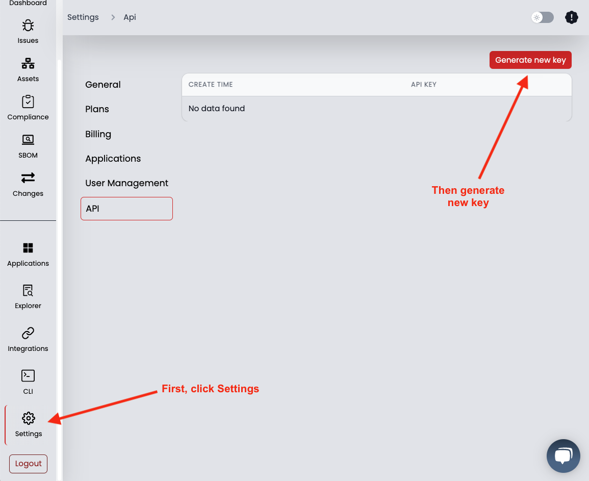
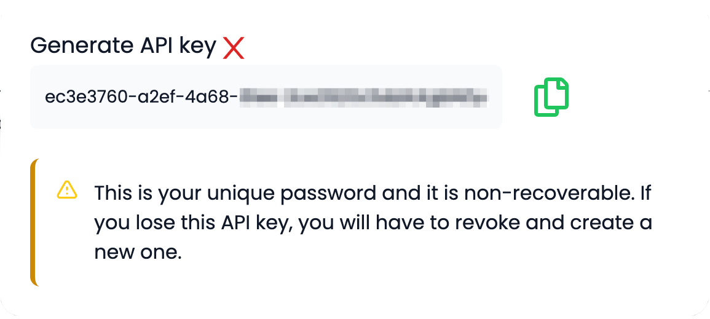
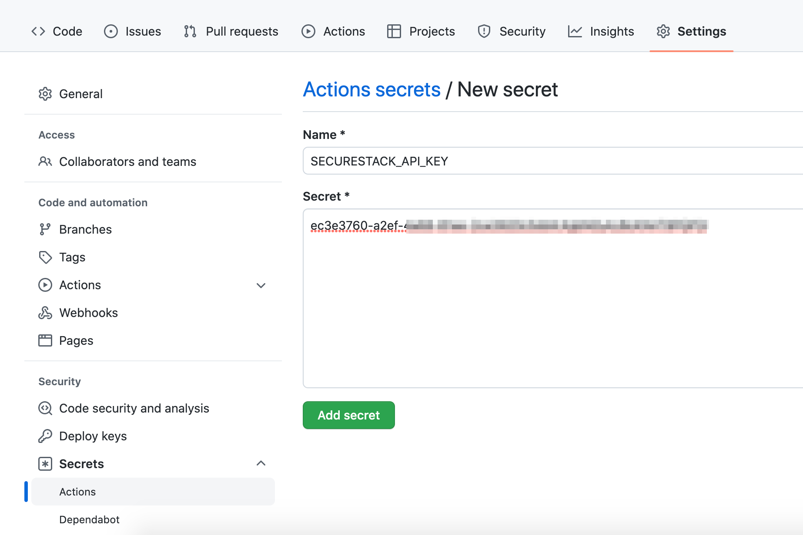
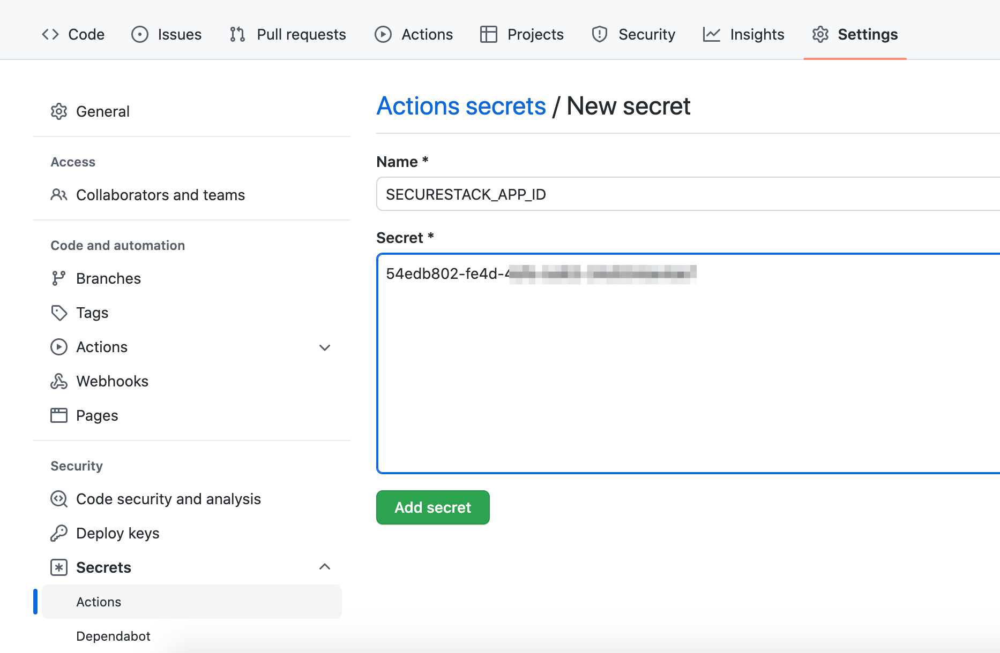

# SecureStack - One Github Action To Rule Them All

This Action provides comprehensive security coverage for your entire GitHub project workflow! This is the SecureStack kitchen sink and combines 3 different GitHub Actions into one awesome Action to rule them all!  When you add this Action to your repository it will:

* Analyze source code for sensitive data like API keys, database credentials, passwords, etc
* Analyze source code for any vulnerable third-party or open source libraries with our software composition analysis  
* If your app is running in the public cloud we'll analyze it for cloud misconfigurations and inseure settings
* If your app has a public URL endpoint we will scan the public URL with our web vulnerability scanner
* Finally, we will build a SBOM for your application

```
name: Example Workflow Using SecureStack All-In-One Action
on: push
jobs:
  security:
    runs-on: ubuntu-latest
    steps:
      - name: Checkout repo for running secrets analysis within workflow
        id: checkout
        uses: actions/checkout@v2.4.0
        with:
          fetch-depth: 0
      - name: Secrets Analysis Step
        id: secrets
        uses: SecureStackCo/actions-secrets@v0.1.3
        with:
          securestack_api_key: ${{ secrets.SECURESTACK_API_KEY }}
          securestack_app_id: ${{ secrets.SECURESTACK_APP_ID }}
          severity: critical
          flags: '-d 1'
      - name: Code Analysis Step
        id: code
        uses: SecureStackCo/actions-code@v0.1.1
        with:
          securestack_api_key: ${{ secrets.SECURESTACK_API_KEY }}
          securestack_app_id: ${{ secrets.SECURESTACK_APP_ID }}
          severity: critical
          language: node
      - name: Exposure Analysis Step
        id: exposure
        uses: SecureStackCo/actions-exposure@v0.1.3
        with:
          securestack_api_key: ${{ secrets.SECURESTACK_API_KEY }}
          securestack_app_id: ${{ secrets.SECURESTACK_APP_ID }}
          severity: critical
          flags: '--dom -r'
      - name: Create SBOM
        id: sbom
        uses: SecureStackCo/actions-sbom@v0.1.1
        with:
          securestack_api_key: ${{ secrets.SECURESTACK_API_KEY }}
          securestack_app_id: ${{ secrets.SECURESTACK_APP_ID }}
          severity: critical
```

NOTE - to understand possible values for the action input `flags`, run the SecureStack cli locally:

`$ bloodhound-cli --help`

## Create your SecureStack API Key and save as GitHub Secret

1. Log in to [SecureStack](https://app.securestack.com) with your GitHub credentials.
2. Go to Settings in the lower left corner, and then select the 6th tab: API.
3. Generate a new API key and copy the value.
4. Now back in GitHub, go to Settings for your GitHub repository and click on Secrets, and then Actions at the bottom left.
5. Create a new secret named SECURESTACK_API_KEY and paste the value from step 2 into the field and click "Add secret".

## Retreiving your SecureStack Application ID

1. Log in to [SecureStack](https://app.securestack.com).
2. In the application drop down at the top left choose the application you want to use and click on "Copy Application ID" 
3. Create a new secret named SECURESTACK_APP_ID and paste the value from step 2 into the field and click "Add secret".
4. When completed the two GitHub Secrets should look like this


### Watch this video to learn how to setup your first GitHub Action with SecureStack
Coming soon!


## Check out our other GitHub Actions:
1. [SecureStack Software Composition Analysis (SCA)](https://github.com/marketplace/actions/securestack-application-composition-analysis) - Scan your application for vulnerable third-party and open source libraries.
2. [SecureStack Secret Scanning](https://github.com/marketplace/actions/securestack-secrets-analysis) - Scan your application for embedded api keys, credentials and senstive data.
3. [SecureStack Web Vulnerability & Cloud Misconfiguration Analysis](https://github.com/marketplace/actions/securestack-web-vulnerability-analysis) - Scan your running application url for cloud misconfigurations and web vulnerabilities.
4. [SecureStack Log4j Analysis](https://github.com/marketplace/actions/securestack-log4j-vulnerability-analysis) - Scan your application for Log4j/Log4Shell vulnerabilities.
5. [SecureStack SBOM](https://github.com/marketplace/actions/securestack-sbom) - Create a software bill of materials (SBOM) for your application.
6. Or, our [All-in-One GitHub Action](https://github.com/marketplace/actions/securestack-all-in-one-github-action) - We've put all of our actions together into one "Action to rule them ALL"!

Made with 💜  by [SecureStack](https://securestack.com)
